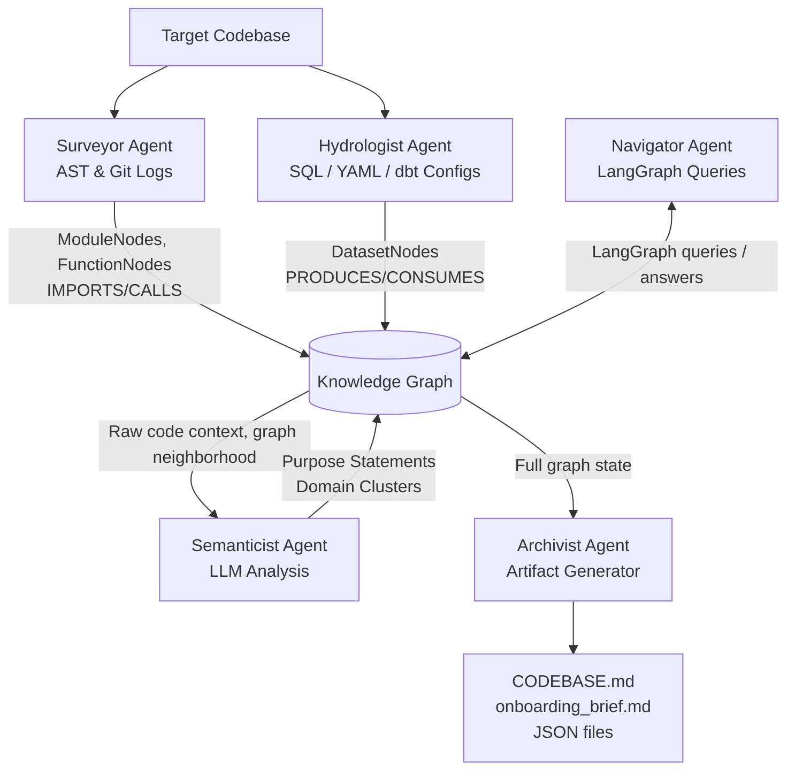

# 1. RECONNAISSANCE.md Content

**Project:** The Brownfield Cartographer  
**Target Repository:** `dbt-labs/jaffle_shop`  
**Mode:** Simulated 30-minute manual day-one analysis

This repository is a compact but realistic dbt analytics project. In a first-pass manual read, the codebase appears intentionally clean, which makes it excellent for validating whether a multi-agent intelligence system can reconstruct business flow, lineage, and impact faster than a human reading SQL and YAML files by hand.

**Five FDE Day-One Questions**

**1. What is the ingestion path?**  
The primary ingestion path begins with dbt seeds and dbt sources. The repository models raw business entities such as customers, orders, and payments, then standardizes them through staging models before producing curated downstream analytics models. Practically, the path is: raw seed/source-style inputs → `stg_*` models → final marts such as `customers` and `orders`.

**2. What are the critical outputs?**  
The most critical outputs are the downstream curated datasets that a business stakeholder would actually query:

- `customers`: customer-level rollup with lifetime and behavioral metrics
- `orders`: order-level analytic table used for transaction and fulfillment analysis
- intermediate staging models such as `stg_customers`, `stg_orders`, and `stg_payments` are also operationally critical because they feed the final marts

**3. What is the blast radius if something fails?**  
The highest blast radius sits in the staging layer and in commonly referenced transformation models. If `stg_customers` fails, the downstream `customers` mart becomes invalid. If `stg_orders` or `stg_payments` fails, both order-centric reporting and any customer rollups derived from orders/payments are affected. In dbt terms, failure propagates forward through `ref(...)` chains, so a single upstream break can invalidate multiple downstream models in one run.

**4. Where is business logic concentrated?**  
Business logic is split across two layers:

- **Light normalization logic** is concentrated in staging SQL, where naming, typing, and cleanup happen
- **Analytic/business logic** is concentrated in downstream mart models, where joins, aggregations, and customer/order metrics are assembled

This is a strong example of dbt’s recommended layering: source/staging for standardization, marts for business-facing semantics.

**5. What has changed most recently / where is change velocity likely highest?**  
For a mature sample repo like `jaffle_shop`, manual inspection suggests change velocity is probably highest in metadata/config surfaces and orchestration-adjacent files rather than in the core SQL DAG. In practice, likely hotspots include schema YAML, project config, package/version files, and documentation-oriented files, while the core transformation SQL appears comparatively stable.

**Difficulty Analysis**

What is hard to figure out manually is not the high-level DAG shape; that becomes clear fairly quickly. The hard part is the semantic stitching across representations:

- tracking column-level lineage across multiple staging and mart models
- understanding how YAML descriptions and tests map back to specific SQL models
- determining which datasets are true business outputs versus transitional nodes
- estimating blast radius without a graph view
- identifying whether a model is lightly transformed, heavily aggregated, or merely renamed

For a human analyst, the most time-consuming step is bouncing between SQL, `schema.yml`, and the implicit dbt DAG in their head.

# 2. Architecture Diagram

Ingestion and parsing begin with the target codebase, which is split into two parallel analysis paths. The Surveyor Agent consumes source code structure, AST signals, and git history to reconstruct the software skeleton: modules, functions, and their `IMPORTS` and `CALLS` relationships. In parallel, the Hydrologist Agent consumes SQL, YAML, and dbt configuration artifacts to reconstruct the data skeleton: datasets, transformations, and the `PRODUCES` / `CONSUMES` lineage edges that define the analytics DAG.

Enrichment happens after the first structural pass has been written into the Knowledge Graph. At that point, the Semanticist Agent no longer has to read the repository blindly; instead, it can pull graph-centered context, inspect the relevant raw code neighborhood, and write semantic enrichments back into the graph. Concretely, this means adding higher-level fields such as purpose statements and domain clusters so the graph captures not only what is connected, but also what each component is for.

Output and interaction are handled by two different consumers of the same shared graph state. The Archivist Agent reads the full graph and materializes durable artifacts such as `CODEBASE.md`, `onboarding_brief.md`, and JSON exports for downstream review and handoff. The Navigator Agent interacts bidirectionally with the Knowledge Graph through LangGraph-powered queries, enabling a user to ask focused questions about blast radius, ownership, architecture, and lineage without having to manually traverse the codebase.

# 3. Progress Summary

The project scaffolding is working, and the core multi-agent foundation is now established.

- The **Surveyor** is working with tree-sitter-based AST parsing for static code analysis
- The **Hydrologist** is working with `sqlglot`, dbt SQL parsing, and dbt YAML parsing for lineage extraction
- The **Knowledge Graph** layer is working and serializes to JSON successfully
- The **Semanticist** is currently in progress for generating LLM-based purpose statements and semantic annotations
- The **Archivist** is currently in progress for Markdown synthesis, report generation, and maintained contextual summaries

# 4. Early Accuracy Observations

Early results are promising.

- The module graph correctly identifies Python import relationships in the Brownfield Cartographer codebase itself
- The lineage graph accurately reconstructs the dbt DAG for `jaffle_shop`
- In particular, the system captures transformations consistent with dbt’s native model graph, including flows such as `raw_customers` → `stg_customers` → `customers`
- The graph-based representation is already good enough to support downstream queries such as blast radius, source detection, and sink detection

This gives confidence that the current parser stack is recovering the structural truth of the repository rather than inventing relationships.

# 5. Known Gaps and Plan

There are still important gaps before final submission.

- Dead-code detection needs refinement; it currently identifies low-signal cases but is not yet trustworthy enough for strong conclusions
- Documentation drift detection is not yet fully implemented, especially where YAML metadata and SQL logic diverge over time

**Plan for final submission**

- finish the LLM `ContextWindowBudget` work so semantic summarization remains scalable
- complete the LangGraph Navigator tools for graph querying and guided exploration
- generate the final `CODEBASE.md`
- run the final self-audit across functionality, accuracy, and report quality
