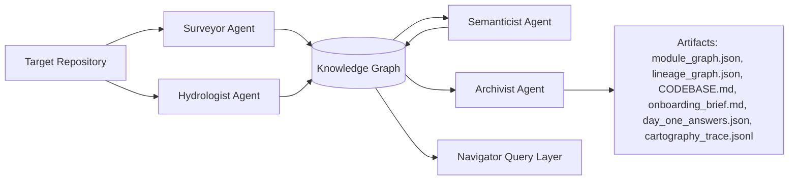

# The Brownfield Cartographer - Final Report

**Author:** Chalie Lijalem   
**Date:** March 14, 2026

---

## 1. Executive Summary

This report evaluates the Brownfield Cartographer as a multi-agent system for day-one software reconnaissance. The tool now produces a graph-backed analysis pipeline that combines structural parsing, data-lineage extraction, semantic summarization, and archival reporting. I tested it in two ways: first, by manually performing a day-one reconnaissance of the `dbt-labs/jaffle_shop` repository and comparing that manual understanding against Cartographer’s generated onboarding output; second, by running Cartographer on its own codebase to inspect whether the system can describe itself accurately.

The overall result is encouraging. On `jaffle_shop`, the generated Day-One answers were often directionally correct: the system correctly recognized that the repository is a dbt-based analytics project, identified staging and mart models as important reading order, and correctly described the raw-to-staging-to-mart flow. However, it also revealed a meaningful weakness: the generated `CODEBASE.md` for `jaffle_shop` drastically undercounted the actual architecture and reported only one module with no datasets or transformations. This means that, at the artifact level, the system currently reasons better in prose than it does in fully faithful structural summarization for SQL/dbt-first repositories.

For real forward-deployed engineering work, that is still useful. A tool that produces a decent first-pass onboarding brief, blast-radius hints, and evidence-linked summaries can save time during an engagement. But the report also makes clear where trust should be qualified: deeply SQL-first repos, opaque dynamic references, and cross-representation merges between Python, SQL, and YAML still require careful human review.

---

## 2. Manual Day-One Analysis vs. System-Generated Output

### 2.1 Manual Day-One Analysis of `jaffle_shop`

My manual reading of `jaffle_shop` led to five high-confidence conclusions:

1. **Primary capability:** the repo transforms raw e-commerce source data into clean dbt models and downstream business-facing marts.
2. **Critical reading order:** the most important starting points are dbt sources/seeds, staging models such as `stg_customers`, `stg_orders`, and `stg_payments`, then the downstream marts such as `customers` and `orders`.
3. **Blast radius:** failures in staging models propagate widely because downstream marts depend on them through `ref(...)` chains.
4. **Business logic concentration:** lightweight normalization is concentrated in staging; business-facing aggregations live in marts.
5. **Likely recent change hotspots:** config and metadata surfaces are likely more volatile than the clean, compact SQL DAG itself.

That manual assessment was based on a human-first interpretation of dbt layering rather than full graph reconstruction.

### 2.1.1 What Was Hardest to Figure Out Manually

The hardest part of the manual reconnaissance was not reading any single file; it was reconstructing the repository's **shape across multiple representations**. `jaffle_shop` is deceptively compact. Each SQL file is short and understandable, but the architectural meaning is distributed across model SQL, YAML metadata, dbt `ref(...)` chains, and workflow/config files. No single artifact explains the whole system. I had to move repeatedly between staging models, marts, and metadata surfaces, then keep a mental model of how those pieces connected into a DAG.

The second major difficulty was **dependency visibility**. By hand, it was easy to say that staging models matter, but much harder to say exactly how far a change in `stg_orders` or `stg_payments` would propagate without tracing multiple downstream references manually. The repository is small enough that this is possible, but it is still time-consuming and error-prone. This was the clearest pain point during reconnaissance: the questions that matter most on day one—where should I start reading, and what breaks if I change this?—are precisely the questions that require graph reconstruction rather than file-by-file reading.

The third difficulty was **separating visible control-plane code from true semantic centrality**. Files like the dbt Cloud workflow script stand out immediately because they look operationally important, but that does not mean they are the best entry point for understanding the business logic. Manually, I had to correct for this bias and keep refocusing on the dbt transformation layers, because those layers carry more of the system's actual analytical meaning than the orchestration wrapper.

These manual obstacles directly motivated Cartographer's design priorities. The system needs to recover dependency structure, preserve evidence, and distinguish structural importance from surface-level visibility. In that sense, the hardest part of manual exploration became the core product requirement: automate the synthesis of many small local clues into a usable architecture map, lineage view, and onboarding brief.

### 2.2 System-Generated Output Summary

Cartographer’s generated `onboarding_brief.md` for `jaffle_shop` reached the following conclusions:

- the repository supports automated transformation and orchestration of raw e-commerce data into an analytical data mart;
- the workflow starts with `.github/workflows/scripts/dbt_cloud_run_job.py`, then moves through staging SQL and marts;
- the highest-risk change surface is the dbt Cloud orchestration script plus key staging models;
- data enters from raw `ecom` sources, moves through staging, then exits as refined analytical datasets;
- the domain split is mainly `orchestration` plus transformation logic.

At the natural-language level, that output is readable and useful. At the structural level, however, the generated `CODEBASE.md` for the same remote run reported:

- **1 module**
- **0 datasets**
- **0 transformations**

This is clearly inconsistent with the actual repository shape. `jaffle_shop` is dominated by dbt SQL models and data-lineage artifacts, so a structurally faithful report should have highlighted many transformation relationships rather than a single Python orchestration file.

### 2.3 Side-by-Side Comparison

| Question | Manual conclusion | System conclusion | Judgment |
| --- | --- | --- | --- |
| What business capability does the codebase support? | dbt analytics transformation of raw e-commerce data into marts | automated transformation and orchestration into an analytical data mart | **Mostly correct** |
| What should a new engineer read first? | staging models, marts, dbt source flow | dbt Cloud workflow script first, then staging and marts | **Partially correct** |
| Where is blast radius highest? | staging layer and common upstream refs | orchestration script + staging models | **Partially correct** |
| How does data enter, move, and exit? | raw sources → staging → marts | raw `ecom` sources → staging → marts | **Correct** |
| What architecture map explains the repo? | dbt DAG with layered transformation semantics | orchestration domain + transformation domain | **Partially correct / oversimplified** |

### 2.4 What the Comparison Shows

The comparison suggests that Cartographer is already better at **semantic summarization with citations** than at **faithfully representing SQL-heavy architecture in its top-level structural summary**. In other words, the language layer is promising, but the structural abstraction for dbt-first repositories still trails what a careful human can infer by reading the models directly.

---

## 3. Final Architecture Diagram: Four-Agent Pipeline

The finalized pipeline is centered on four core production agents. Navigator is intentionally treated as a post-analysis consumer rather than part of the core generation pipeline.

### 3.1 Agent Roles

**Surveyor Agent**  
Surveyor performs structural reconnaissance over the repository. It parses Python modules, builds import and call relationships, calculates PageRank-style centrality, and surfaces signals such as architectural hubs, strongly connected components, and change velocity.

**Hydrologist Agent**  
Hydrologist reconstructs the data movement layer. It parses Python IO flows, embedded SQL, standalone SQL, dbt model references, and YAML/config signals to generate lineage nodes and edges. In the current version it also records richer edge metadata such as `transformation_type`, `source_file`, `line_start`, `line_end`, and `dialect`, while logging unresolved dynamic references for later review.

**Semanticist Agent**  
Semanticist enriches the structural graph with human-meaningful interpretations. It generates purpose statements, identifies domain clusters, detects documentation drift, and synthesizes five Day-One answers with evidence-backed citations.

**Archivist Agent**  
Archivist materializes the durable outputs. It produces `CODEBASE.md`, `onboarding_brief.md`, `day_one_answers.json`, and `cartography_trace.jsonl`. It is also the layer responsible for preserving timestamps, evidence sources, confidence values, and analysis methods so the report trail remains inspectable.

### 3.2 Why this Architecture Matters

This decomposition mirrors a practical brownfield workflow. First, recover shape. Second, recover data movement. Third, infer meaning. Fourth, archive results in a form that another engineer can consume. The advantage of the design is separation of concerns: each agent can fail or improve somewhat independently. The main downside is that cross-agent merge fidelity becomes the real challenge, especially when the repository is dominated by SQL/dbt rather than Python modules.

### 3.3 Key Design Tradeoffs

The architecture also reflects deliberate engineering tradeoffs rather than a purely ideal decomposition.

**Deferring LLM calls to a later phase for cost and control.**  
Surveyor and Hydrologist run first using mostly deterministic parsing because structural recovery is cheaper, faster, and more reproducible than semantic synthesis. Deferring LLM usage until Semanticist keeps token costs bounded, reduces latency on repeated runs, and ensures that expensive summarization happens only after the system has already recovered the strongest structural evidence it can. This also improves discipline: prose is generated from graph evidence rather than used as a substitute for missing parsing.

**Using a NetworkX-based in-memory graph instead of a full graph database.**  
For this project stage, NetworkX is a pragmatic choice. It makes graph composition, PageRank, SCC analysis, and JSON serialization straightforward without requiring external infrastructure. A full graph database would offer persistence, richer query ergonomics, and potentially better scaling for very large repos, but it would also introduce operational overhead that works against the goal of a lightweight, developer-local reconnaissance tool. The tradeoff is that NetworkX is simpler and easier to ship now, while a graph database could become more attractive later if scale and interactive querying become dominant requirements.

**Preserving file artifacts instead of relying only on an interactive query layer.**  
The markdown and JSON outputs are intentional design products, not side effects. `CODEBASE.md`, `onboarding_brief.md`, and `day_one_answers.json` provide stable artifacts for handoff, review, and AI context injection. A query-only interface would be more dynamic, but it would be weaker for auditability and collaboration because engineers could not easily inspect or reuse a frozen analysis snapshot.

**Separating structural extraction from semantic interpretation even though that creates merge risk.**  
This separation improves modularity and makes failure modes easier to diagnose. If an answer is wrong, I can ask whether the parser missed structure or whether Semanticist overgeneralized from incomplete evidence. The cost of that modularity is visible in this report: when structural coverage is weak, the narrative layer can still sound confident. I accepted that tradeoff because it is easier to improve merge fidelity incrementally than to debug a monolithic system where parsing and interpretation are fused together.

---

## 4. Accuracy Analysis: Which Day-One Answers Were Correct, Wrong, and Why

### 4.1 Answer 1 — Business Capability

**System answer:** the repo supports transformation and orchestration of raw e-commerce data into analytics-ready marts.  
**Assessment:** **Correct.**

**Why it was correct:**

- it recognized the repository as a data transformation system rather than a generic Python app;
- it cited both orchestration and dbt model files;
- it captured the purpose at the right abstraction level for onboarding.

**What was still imperfect:**

- the answer slightly overweighted orchestration because the dbt Cloud helper script was one of the most visible Python modules.

### 4.2 Answer 2 — What to Read First

**System answer:** start with `.github/workflows/scripts/dbt_cloud_run_job.py`, then `stg_orders`, `stg_order_items`, and `customers.sql`.  
**Assessment:** **Partially correct.**

**Why it was partly right:**

- it did point a new engineer toward staging models and a downstream mart, which is useful;
- it identified an executable workflow file that helps explain operational orchestration.

**Why it was not fully correct:**

- the real critical path of `jaffle_shop` is the dbt DAG, not the CI/helper script;
- a human would likely start with sources, staging, and dbt refs before the GitHub workflow script;
- the reading order reflects Python prominence in the analysis stack more than the repository’s dominant semantics.

### 4.3 Answer 3 — Highest-Risk Change Surfaces

**System answer:** the dbt Cloud run script plus core staging models are the highest-risk surfaces.  
**Assessment:** **Partially correct.**

**Why it was partly right:**

- staging models are indeed high blast-radius surfaces because many downstream marts depend on them;
- changes in commonly referenced transformation logic do cascade.

**Why it was partly wrong:**

- the orchestration script is important operationally, but it is not necessarily the dominant business-risk surface for analytics correctness;
- the answer misses that model dependencies and dbt graph centrality matter more than a single helper script in many day-one situations.

### 4.4 Answer 4 — Data Flow Through the System

**System answer:** raw `ecom` sources feed staging, which feeds marts and refined analytical datasets.  
**Assessment:** **Correct.**

**Why it was correct:**

- it accurately described the repo’s layered data flow;
- it named concrete staging and mart models;
- it gave an FDE a usable explanation of system movement without requiring DAG graph inspection.

### 4.5 Answer 5 — Domain Architecture Map

**System answer:** the codebase splits into orchestration plus transformation responsibilities.  
**Assessment:** **Partially correct but oversimplified.**

**Why it was useful:**

- it distinguished operational job control from model logic;
- it gave a clean top-level frame for a new engineer.

**Why it fell short:**

- `jaffle_shop` is better understood as a dbt transformation DAG with staging and marts, not as a balanced two-domain application;
- the answer compressed business semantics too aggressively and did not expose the layered model structure as strongly as a human would.

### 4.6 Structural Accuracy vs. Narrative Accuracy

The biggest accuracy gap is not in prose but in **artifact fidelity**. The onboarding brief was directionally competent, but the generated `CODEBASE.md` for `jaffle_shop` said there was only one module and no datasets or transformations. That is a serious underrepresentation of the repository. So the fairest conclusion is:

- **Narrative accuracy:** medium to good
- **Structural accuracy for SQL/dbt-first repos:** currently inconsistent
- **Usefulness for onboarding:** good as a first pass, not yet sufficient as a source of truth

---

## 5. Limitations: What Cartographer Still Fails to Understand

The current Cartographer works well enough to be valuable, but several limitations remain visible.

### 5.1 SQL/dbt-First Repositories Are Still Under-modeled

The clearest limitation from `jaffle_shop` is that the system can produce reasonable natural-language answers while still underrepresenting the actual repository structure in `CODEBASE.md`. This means the merge between structural Python analysis and lineage-driven SQL analysis is not yet fully trustworthy at the summary level.

### 5.2 Opaque Dynamic References

Dynamic Python expressions, constructed paths, indirect SQL strings, and runtime-generated identifiers remain hard to resolve. I added unresolved dynamic reference logging to improve introspection, but the system still cannot reliably infer the final target of every dynamic call.

### 5.3 Column-Level Meaning Is Still Weak

Cartographer can recover table/model-level relationships far more reliably than column-level lineage or business semantic intent. It still struggles to answer questions like “which exact metric changed?” or “which upstream column defines this downstream KPI?” without human follow-up.

### 5.4 Architecture Summaries Can Be Biased Toward Python Entry Points

Because Surveyor currently provides very strong Python-centric structural signals, repositories that contain small Python orchestration surfaces plus many SQL assets can be overinterpreted through the Python layer. This is exactly what happened with `jaffle_shop`, where the orchestration script appeared more central in summaries than it should have.

### 5.5 Later-Agent Confidence Can Exceed Earlier-Agent Fidelity

The Semanticist can produce a polished answer even when the underlying graph is incomplete. That is good for readability but dangerous for over-trust. In practice, a clean onboarding paragraph should not be confused with a structurally complete representation.

### 5.6 Self-Audit Blind Spots

When Cartographer analyzes itself, it does a decent job of identifying the orchestrator, graph layer, schemas, and agents. But it still has a tendency to flatten nuanced responsibilities into clean domain clusters. Human review is still needed to judge whether the cluster labels and critical-path claims are truly operationally meaningful.

---

## 6. FDE Applicability

In a real client engagement, I would use Brownfield Cartographer as a **first-48-hours acceleration tool** rather than as an autonomous architecture authority. I would point it at the client repository immediately after environment setup, generate the graph and onboarding artifacts, and use those outputs to guide stakeholder interviews, code-reading order, and blast-radius discussions. The greatest value would be speed: instead of beginning from a blank page, I would begin with a draft architectural narrative, a candidate critical path, and evidence-linked hypotheses about risk surfaces. I would still validate all high-impact claims with engineers and repository owners, but the tool would compress the time required to become conversant in the system.

---

## 7. Self-Audit Results

### 7.1 What I Was Able to Verify in This Workspace

I successfully ran Cartographer on the Brownfield Cartographer repository itself and generated the current local artifacts. The local outputs were substantially stronger than the `jaffle_shop` structural summary because this repository is Python-heavy and matches the current strengths of Surveyor and Semanticist.

Examples of accurate self-audit observations include:

- the CLI and `Orchestrator` were correctly identified as the main operational entry path;
- the graph layer and schema layer were correctly surfaced as central structural dependencies;
- the generated Module Purpose Index in `CODEBASE.md` gave a plausible breakdown of the system into orchestration, software intelligence, data lineage, knowledge graph, and model layers.

### 7.2 Important Discrepancies in the Self-Audit

Even on its own repository, the tool still shows discrepancies:

- it tends to present clean domain boundaries even where the implementation is more interleaved;
- risk surfaces are inferred from graph prominence and git velocity, which is useful but not equivalent to true production risk;
- the semantic summaries are sometimes more polished than the raw graph evidence justifies.

### 7.3 Week 1 Repo Self-Audit: `Roo-Code`

I ran Brownfield Cartographer on my Week 1 repository, `https://github.com/chacha1921/Roo-Code`, and compared the generated artifacts against the architecture I would expect from a large TypeScript-based AI coding assistant extension.

The strongest part of the self-audit was the **semantic interpretation**. The generated onboarding brief correctly identified the repo as an AI-powered code assistant integrated into a development environment. It also highlighted the modules I would expect a new engineer to read first:

- `src/core/webview/ClineProvider.ts`
- `src/core/task/Task.ts`
- `src/core/assistant-message/presentAssistantMessage.ts`
- `src/shared/tools.ts`
- `src/api/providers/anthropic.ts`

That reading order is credible. It captures the real operational path of the system: user interaction enters through the extension/webview layer, task execution is coordinated in the task engine, assistant responses are parsed and routed, tool definitions constrain the assistant’s capabilities, and provider adapters handle model communication.

The generated risk analysis was also directionally strong. It correctly treated `src/shared/tools.ts`, `src/core/task/Task.ts`, `src/core/webview/ClineProvider.ts`, and `src/core/assistant-message/presentAssistantMessage.ts` as high-risk change surfaces because those files sit on the core interaction boundary between the user, the tool system, and the model provider. For an onboarding scenario, that is useful and actionable.

However, the self-audit also exposed a clear structural weakness. The generated `CODEBASE.md` reported **0 modules, 11 datasets, and 7 transformations**, with **no module import critical path available**. For a TypeScript-heavy extension repository, that is not the right top-level structural picture. In practical terms, the system understood the repository’s purpose better than it understood its actual module graph. That suggests the current Surveyor stack is still much stronger on Python than on a mixed or TypeScript-dominant repository, while Hydrologist-style extraction can surface nodes that dominate the summary even when they are not the main architectural story.

So the Week 1 self-audit result is mixed in a useful way:

- **What Cartographer got right:** overall business capability, likely onboarding order, key control-plane files, and a plausible layered architecture split between UI, task orchestration, model/provider abstraction, and infrastructure.
- **What Cartographer got wrong or under-modeled:** the true module inventory, the critical-path structure of the TypeScript codebase, and the top-level balance between code modules and lineage-style graph nodes.

My conclusion from this self-audit is that Cartographer is already valuable for **fast orientation and semantic reconnaissance** on my Week 1 repo, but it is not yet fully reliable as a **structural source of truth** for TypeScript-first systems. In a real engineering workflow, I would trust it to propose where to start reading and which files look important, but I would still validate the architecture map manually before using it to justify refactors or dependency-critical decisions.

---

## 8. Final Reflection

The Brownfield Cartographer is now credible as a serious onboarding and reconnaissance assistant. Its strongest contributions are speed, evidence-backed summaries, queryable graph artifacts, and a clean multi-agent separation of responsibilities. Its main weakness is not that it says nothing useful, but that it can sometimes sound more certain than its structural coverage warrants. That makes the current version valuable in exactly the way many real engineering tools are valuable: not as a replacement for human architectural judgment, but as a force multiplier that helps an engineer ask better questions faster.
